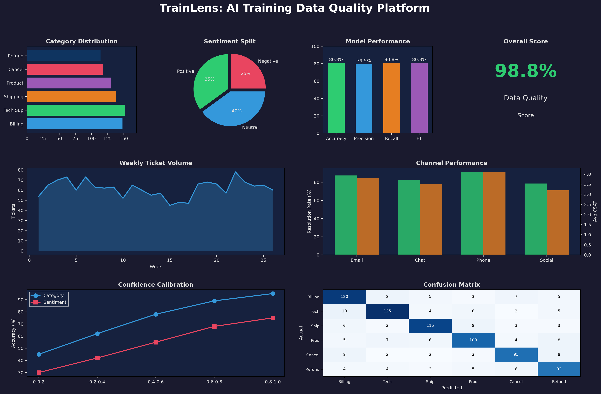

# TrainLens

[](https://github.com/Nilesh-builds/trainlens/actions/workflows/ci.yml)
[](https://www.python.org/)
[](https://streamlit.io/)

TrainLens is a customer-support data quality and evaluation platform. It checks raw tickets, assigns category and sentiment labels, routes uncertain predictions for review, and reports model performance through a Streamlit dashboard.

The project is designed to answer a practical question: **Can this dataset be trusted for AI training and evaluation?**



## Pipeline

```text
Raw tickets
    -> Quality validation
    -> Analytics reports
    -> AI labeling
    -> Human review queue
    -> Evaluation metrics
    -> Streamlit dashboard
```

## What It Includes

- A five-dimension validation framework: completeness, validity, uniqueness, consistency, and timeliness
- Eleven data quality checks with pass rates and affected-row counts
- DuckDB and pandas reports for category, sentiment, channel, agent, priority, and time trends
- Hybrid labeling with Groq LLM batches and a local keyword fallback
- Confidence-based review routing
- Simulated human review with agreement and disagreement analysis
- Accuracy, precision, recall, F1, confusion matrices, and calibration reports
- A dark Streamlit dashboard with Plotly charts and CSV export
- Automated tests and GitHub Actions CI

## Latest Baseline

The generated dataset contains 852 customer-support conversations after quality issues are injected. Results vary slightly because the review simulation samples records randomly.

| Metric | Observed value |
|---|---:|
| Dataset size | 852 conversations |
| Quality score | 98.81% |
| Category accuracy | 74.02% |
| Category F1 | 73.86% |
| Sentiment accuracy | 77.94% |
| Sentiment F1 | 77.89% |
| Review queue | 12.32% |
| Automated tests | 19 passing |

The generator adds explicit but natural sentiment cues so the baseline can be evaluated against the message text. The benchmark still includes malformed records and unknown values to exercise the quality checks.

## Quick Start

Use Python 3.10 or newer.

```powershell
git clone https://github.com/Nilesh-builds/trainlens.git
cd trainlens
pip install -r requirements.txt
```

Run the pipeline:

```powershell
python scripts/run_pipeline.py
```

Start the dashboard:

```powershell
streamlit run src/dashboard/app.py
```

Run tests:

```powershell
pytest -q
```

## Optional Groq LLM

The default pipeline works without an API key. It uses the rule-based fallback when LLM access is disabled, unavailable, or rate-limited.

Create a local `.env` file in the project root. It is ignored by Git.

```env
GROQ_API_KEY=gsk_your_key_here
GROQ_MODEL=openai/gpt-oss-20b
USE_LLM=true
LLM_BATCH_SIZE=20
```

The key must come from Groq Console. Never commit `.env`, paste a key into source code, or include it in screenshots. `.env.example` contains the safe template.

The LLM path sends tickets in batches to reduce free-tier API usage. If Groq returns an error or rate limit, TrainLens switches to the local fallback for the rest of that run.

## Deploy the Dashboard

For Streamlit Community Cloud:

1. Select this repository and the `main` branch.
2. Set the main file to `src/dashboard/app.py`.
3. Add `GROQ_API_KEY`, `GROQ_MODEL`, and `USE_LLM` under App settings and Secrets.
4. Keep `USE_LLM=false` if the dashboard should run without external API calls.

The repository does not require generated data to be committed. Run the pipeline after deployment or provide the generated data through the selected deployment workflow.

## Dashboard Tabs

| Tab | Contents |
|---|---|
| Overview | Ticket volume, quality score, categories, sentiment, channels, and trends |
| Data Quality | Dimension scores and individual check results |
| Analytics | Category-sentiment heatmap, confidence, and message-length analysis |
| AI Labeling | Confidence tiers, low-confidence samples, and label distribution |
| Evaluation | Accuracy, calibration, per-category results, and confusion matrix |
| Review Queue | Pending reviews, agreement, disagreements, and review candidates |

## Repository Layout

```text
trainlens/
├── data/
│   ├── raw/                 # Generated source tickets
│   ├── labeled/             # Labels and review results
│   └── processed/           # Analytics and evaluation reports
├── src/
│   ├── data_quality/        # Validation checks and quality reports
│   ├── analytics/           # DuckDB analytics pipeline
│   ├── ai_labeling/         # Groq batch labeling and fallback rules
│   ├── review/              # Human review queue
│   ├── evaluation/          # Model metrics and error analysis
│   └── dashboard/           # Streamlit app
├── scripts/                 # Data generation and pipeline runner
├── tests/                   # Pytest suite
├── assets/                  # Dashboard preview image
└── .github/workflows/       # Continuous integration
```

## Technology

- Python, pandas, and NumPy
- DuckDB for SQL analytics
- Groq-compatible OpenAI API and keyword fallback
- scikit-learn for evaluation metrics
- Streamlit and Plotly for the dashboard
- Pydantic for validation models
- pytest and GitHub Actions for testing

## Current Limitations

- The demo dataset is synthetic and intentionally contains injected quality issues.
- Sentiment labels need richer text cues for a stronger baseline.
- Free API limits can restrict how many tickets receive LLM labels in one run.
- Human review is simulated; a production deployment would connect a real reviewer workflow.

## Next Improvements

- Add a real review UI with persistent reviewer decisions
- Add batch retry scheduling for rate-limited LLM requests
- Add sentiment-aware synthetic message generation
- Add data drift monitoring between pipeline runs
- Add a model/provider adapter for Groq, OpenRouter, and local Ollama models

## License

MIT
